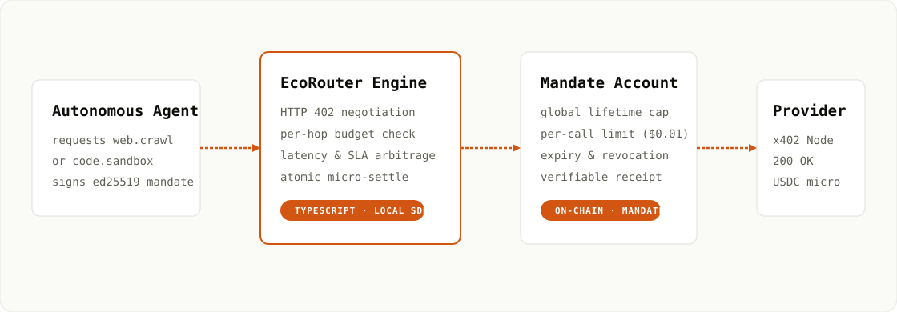
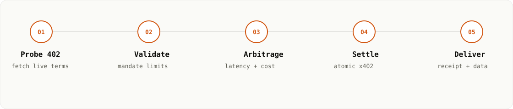

# Arbiter

> Capability-based purchasing for autonomous software, with spending limits
> enforced by a Stellar smart account.

[](packages/sdk)
[](contracts/arbiter-account)
[](https://stellar.org)
[](packages/sdk/src/x402)

Arbiter lets an agent ask for a capability—V1 supports only `web.search`—rather
than selecting a vendor. The local SDK requests live prices from compatible
providers, rejects offers that violate policy or the on-chain mandate, chooses
the lowest economic-cost provider, coordinates an exact USDC payment, and
normalizes the response.

Private keys remain in the developer's process. There is no Arbiter server,
database, account system, remote registry, dashboard, or custodial wallet.



## Project status

> [!WARNING]
> **Arbiter V1 is not complete or production-ready.** The routing SDK foundation
> and smart-account implementation exist, but real Stellar Testnet x402
> settlement, contract acceptance tests, two live paid providers, and the full
> adversarial/E2E suites are still outstanding. Unit tests use local test doubles
> and do not prove real payment settlement.

| V1 area | Status | Notes |
| --- | --- | --- |
| Package and public TypeScript API | In progress | Builds locally as `@arbiter-ai/sdk` |
| Live HTTP 402 challenge discovery | Implemented | Challenges configured providers concurrently |
| Challenge and policy validation | In progress | Core fields and budget boundaries are checked |
| Deterministic economic router | Implemented | Cost, price, then provider ID determine order |
| Result normalization | Implemented | Strict `WebSearchResult` shape |
| Process-local idempotency | In progress | Completed IDs are cached; broader state tests remain |
| Soroban mandate contract | In progress | Implementation exists; required contract tests are missing |
| Local Stellar signing and x402 settlement | Not implemented | `PaymentClient` is currently an integration boundary |
| Two real Testnet paid providers | Not implemented | Required for V1 acceptance |
| Real Testnet E2E and adversarial tests | Not implemented | Required before V1 can be called done |
| npm publication | Not published | Package metadata exists; release workflow is outstanding |

## How a request works

1. The application calls `arbiter.execute({ capability: "web.search", ... })`.
2. The SDK sends an unpaid request to every configured candidate.
3. Each provider must answer with an x402 V2 `exact` HTTP 402 challenge.
4. Arbiter validates network, asset, recipient, atomic amount, policy, and mandate.
5. Eligible providers are scored deterministically.
6. The local payment integration signs through the restricted session signer.
7. The Soroban account independently enforces the mandate.
8. The selected provider settles and returns its provider-specific response.
9. Arbiter returns normalized results, its decision, and the transaction hash.



## Economic routing

Arbiter never uses an LLM to select a provider. For every eligible offer:

```text
expected_effectiveness = qualityScore × successRate
economicCost           = priceAtomic / expected_effectiveness
```

The smallest economic cost wins. Equal scores are resolved by lower price and
then lexical provider ID, making selection reproducible. Prices remain integer
USDC atomic units throughout validation and routing; decimal strings are only a
public input/output representation.

## SDK quickstart

Requirements: Node.js 20 or newer and pnpm 10.

```bash
pnpm install
pnpm build
pnpm test
```

The intended public API is:

```ts
import { Arbiter } from "@arbiter-ai/sdk";

const arbiter = new Arbiter({
  account: process.env.ARBITER_ACCOUNT!,
  sessionSecret: process.env.ARBITER_SESSION_SECRET!,
  paymentClient, // local Stellar/x402 implementation; not yet shipped
  providers: [
    {
      id: "search-a",
      capability: "web.search",
      endpoint: "https://provider-a.example/search",
      qualityScore: 0.82
    },
    {
      id: "search-b",
      capability: "web.search",
      endpoint: "https://provider-b.example/search",
      qualityScore: 0.93
    }
  ]
});

const result = await arbiter.execute({
  executionId: "research-2026-09-10",
  capability: "web.search",
  input: { query: "latest lithium carbonate prices" },
  policy: { maxSpendUsdc: "0.05", minimumQuality: 0.8 }
});

console.log(result.output.results);
console.log(result.decision);
console.log(result.payment.transactionHash);
```

`paymentClient` is deliberately called out above: today it is an injected local
interface, not a completed built-in Stellar integration. See
[`packages/sdk/src/types.ts`](packages/sdk/src/types.ts) for its current contract.

## Smart-account contract

The Soroban contract stores one active mandate:

```rust
struct Mandate {
    session_public_key: BytesN<32>,
    asset: Address,
    total_limit: i128,
    spent: i128,
    max_payment: i128,
    expires_at: u64,
    revoked: bool,
}
```

The owner can create or replace the mandate, revoke it, and withdraw tokens. The
session signer is accepted only through `__check_auth` for a single token
`transfer` from the contract. The hook checks the signature, asset, source,
positive amount, per-payment maximum, cumulative limit, expiry, and revocation.

```bash
cargo test --workspace
cargo build --target wasm32v1-none --release -p arbiter-account
```

The Soroban SDK is pinned in [`Cargo.toml`](Cargo.toml). A passing build alone is
not the security acceptance gate: every case in the PRD's required contract and
adversarial suites must also pass.

## Security model

- Owner and session secrets never go to an Arbiter-owned service.
- Payments use `bigint` atomic units, not JavaScript floating point.
- Provider endpoints must use HTTPS; literal local, private, link-local, and
  metadata destinations are rejected.
- SDK policy checks are defense in depth. The Soroban account is the hard
  financial boundary.
- An uncertain settlement must stop with `PAYMENT_SETTLEMENT_UNKNOWN`; the SDK
  must not automatically pay a second provider.

## Repository layout

```text
.
├── packages/sdk/                 # local TypeScript SDK
│   ├── src/providers/            # HTTP 402 + response normalization
│   ├── src/router/               # deterministic selection
│   ├── src/x402/                 # challenge validation
│   └── test/                     # SDK unit/integration tests
├── contracts/arbiter-account/    # Rust Soroban smart account
├── examples/search-agent.ts      # target developer experience
├── docs/                         # static landing page
└── .github/workflows/pages.yml   # GitHub Pages deployment
```

## Landing page

The static site lives in [`docs`](docs). To preview it locally:

```bash
python3 -m http.server 8080 --directory docs
```

Then open `http://localhost:8080`. The Pages workflow deploys `docs/` on pushes
to `main` or `work`, and can also be started with `workflow_dispatch`. Enable
**GitHub Actions** as the Pages source in the repository settings before the
first deployment.

## V1 acceptance path

Work follows the dependency order from the PRD:

- [x] Establish the Soroban smart-account implementation.
- [ ] Complete and pass every smart-account contract test.
- [ ] Implement built-in TypeScript Stellar session signing.
- [ ] Implement real x402 V2 `exact` Testnet USDC settlement.
- [x] Define the `web.search` provider adapter and live challenge path.
- [x] Implement core challenge validation and deterministic routing.
- [x] Implement normalized output and basic process-local idempotency.
- [ ] Integrate two real paid Testnet providers.
- [ ] Pass the direct-contract 0.50/0.05 adversarial test.
- [ ] Pass the unfaked SDK-to-Stellar-to-provider E2E suite.
- [ ] Publish and verify installation of `@arbiter-ai/sdk`.

Arbiter should only be described as **V1 complete** after every unchecked item
and its corresponding PRD acceptance test passes.

## License

Apache-2.0. See package and workspace metadata.
